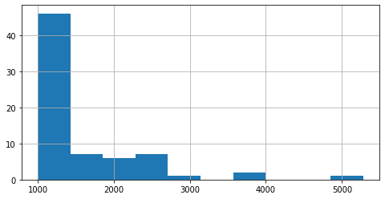

# NLP - Topic Modeling (Python)

## Purpose

For this project I have scraped (for a scraping tutorial see my tutorial [here](https://martschm.github.io/web_scraping_using_scrapy)) news articles from [Reuters](https://uk.reuters.com/news/archive/euro-zone-news) and clustered them using [Latent Dirichlet Allocation (LDA)](https://en.wikipedia.org/wiki/Latent_Dirichlet_allocation).

Since there is no proper classification of articles on Reuters, my model supports the reader in finding **articles relating to a specific topic**. Furthermore, the model could be used to **classify future articles** as well.


## 1 - Data Gathering

I used the scraper i described [here](https://martschm.github.io/web_scraping_using_scrapy) to get all available Euro-Zone news from Reuters.

The data can be downloaded from [here](https://github.com/martschm/martschm.github.io/blob/master/nlp_topic_modeling/20200329_reuters_news_euro_zone.7z).

## 2 - Required Packages


```python
import logging
logging.captureWarnings(True)
```


```python
# Data Processing
from collections import Counter
import datetime as dt
from dateutil.relativedelta import relativedelta
import numpy as np
import pandas as pd

# Plotting
import matplotlib.pyplot as plt
%matplotlib inline
import pyLDAvis
import pyLDAvis.sklearn
from wordcloud import WordCloud

# NLP
import gensim
from nltk.stem import SnowballStemmer
from nltk.util import ngrams
import spacy

# Modeling
from sklearn.decomposition import LatentDirichletAllocation
from sklearn.feature_extraction.text import CountVectorizer
from sklearn.model_selection import GridSearchCV
```

## 3 - Data Cleaning

In this step i read the data into a pandas dataframe, clean missing values and convert dates stored in strings to actual dates.

### 3.1 - Custom Functions


```python
def read_data_from_csv(path_to_data, sep=";"):
    df = pd.read_csv(path_to_data, sep=sep)
    print(f"shape of df: {df.shape}")
    print(f"columns in df: {list(df.columns)}")
    return df

def drop_rows_with_missing_values(df):
    rows_orig = df.shape[0]
    df = df.dropna().reset_index(drop=True)
    print(f"{rows_orig-df.shape[0]} rows dropped")
    print(f"new shape of df: {df.shape}")
    return df

def convert_date_ReutersNews(df, date_col):
    df = df[df.scraper == "reuters_news"].copy()
    month_map = {
        "January":1, "February":2, "March":3,
        "April":4, "May":5, "June":6,
        "July":7, "August":8, "September":9,
        "October":10, "November":11, "December":12
    }
    regex_date = r"([A-Z]\w+) (\d+), (\d+)"
    mdy = df[date_col].str.extract(regex_date)
    df["month"] = mdy[0].map(month_map)
    df["day"] = mdy[1]
    df["year"] = mdy[2]
    df[date_col] = pd.to_datetime(df[['year', 'month', 'day']])
    df = df.drop(['year', 'month', 'day'], axis=1).reset_index(drop=True)
    return df

def convert_dates(df, date_col):
    df_Reuters = convert_date_ReutersNews(df, date_col)
    df_full = pd.concat([df_Reuters])
    print(f"shape of df: {df_full.shape}")
    print(f"columns in df: {list(df_full.columns)}")
    return df_full
```

### 3.2 - Read Data


```python
path_data = "../data/20200329_reuters_news_euro_zone.csv"
df = read_data_from_csv(path_data)
```

    shape of df: (9773, 5)
    columns in df: ['scraper', 'url', 'date', 'title', 'text']
    


```python
df.head(3)
```


<div>
<table border="1" class="dataframe">
  <thead>
    <tr style="text-align: right;">
      <th></th>
      <th>scraper</th>
      <th>url</th>
      <th>date</th>
      <th>title</th>
      <th>text</th>
    </tr>
  </thead>
  <tbody>
    <tr>
      <th>0</th>
      <td>reuters_news</td>
      <td>https://uk.reuters.com/article/us-reuters-edit...</td>
      <td>July 24, 2018 /  8:08 PM / in 3 months</td>
      <td>Reuters Leadership</td>
      <td>Jane Barrett   Rob Cox...</td>
    </tr>
    <tr>
      <th>1</th>
      <td>reuters_news</td>
      <td>https://uk.reuters.com/article/uk-health-coron...</td>
      <td>March 28, 2020 /  4:15 PM / Updated 14 hours ago</td>
      <td>Coronavirus death toll in Italy's Lombardy ris...</td>
      <td>MILAN (Reuters) - The death toll from an outbr...</td>
    </tr>
    <tr>
      <th>2</th>
      <td>reuters_news</td>
      <td>https://uk.reuters.com/article/uk-health-coron...</td>
      <td>March 28, 2020 /  10:01 PM / Updated 10 hours ago</td>
      <td>Northern Ireland brings in tough measures to f...</td>
      <td>BELFAST (Reuters) - Northern Ireland will intr...</td>
    </tr>
  </tbody>
</table>
</div>


### 3.3 - Missing Value Treatment

I decided to drop all rows with missing values


```python
df.isnull().sum()
```


    scraper     0
    url         0
    date       54
    title      54
    text        1
    dtype: int64


```python
df = drop_rows_with_missing_values(df)
```

    55 rows dropped
    new shape of df: (9718, 5)
    

### 3.4 - Converting to Actual Dates

The scraped date has the following form: 'Month DD, YYYY ...'.
Since this can't be properly used as a date, I used RegEx to parse the date from these strings. 


```python
df.date.iloc[0]
```


    'July 24, 2018 /  8:08 PM / in 3 months'


```python
df = convert_dates(df, "date")
```

    shape of df: (9718, 5)
    columns in df: ['scraper', 'url', 'date', 'title', 'text']
    


```python
df.date.iloc[0]
```


    Timestamp('2018-07-24 00:00:00')


## 4 - Exploratory Data Analysis

In this step i looked at published articles over time and futher cleaned the data based on the graphical results. This step is mainly necessary, because over time some of the older news articles are no longer available. 

### 4.1 - Custom Functions


```python
def keep_only_articles_published_after(df, date_col, date_min):
    rows_orig = df.shape[0]
    df = df[df[date_col] >= date_min].copy().reset_index(drop=True)
    print(f"{rows_orig-df.shape[0]} rows dropped")
    print(f"new shape of df: {df.shape}")
    return df
```

### 4.2 - Further Data Cleaning based on Publication Date


```python
df_plot = df.date.value_counts().sort_index().reset_index()
df_plot.columns = ["date", "articles"]
```


```python
fig = plt.figure(figsize=(20,3))
plt.hist(df_plot.date, bins=(df_plot.date.max()-df_plot.date.min()).days+1)
plt.title('Dates w/o Publications', fontsize=24)
plt.xlabel('publication date')
plt.gca().axes.get_yaxis().set_visible(False)
plt.show()
```


This plot clearly shows that some articles published before 09/2018 are no longer available online. The next graphic confirms this.


```python
fig = plt.figure(figsize=(20,3))
plt.plot(df_plot.date, df_plot.articles)
plt.title('Published Articles over Time', fontsize=24)
plt.xlabel('publication date')
plt.ylabel('articles')
plt.show()
```


I have decided to not consider articles before September 2018 for this project.


```python
date_min = dt.datetime(2018,9,1)
df = keep_only_articles_published_after(df, "date", date_min)
```

    2000 rows dropped
    new shape of df: (7718, 5)
    

After all these steps we reduced numbers of articles by 2,055 and are **left with 7,718 articles** over a **time period of 1.5 years**.

## 5 - Feature Engineering

I performed the following steps for **feature engineering** and **text-data cleaning**:
- **Special character replacement**
- **Tokenization** using [gensim.utils.simple_preprocess](https://tedboy.github.io/nlps/generated/generated/gensim.utils.simple_preprocess.html)
- Most of the articles have the following beginning: "Some-City (Reuters) - ". I decided to **remove** this **pre-article information** by searching for "reuters" and deleting all tokens before this keyword
- **Lemmatization** with POS-tagging using spacy's "en_core_web_lg" *(optional)*
- **Stemming** using nltk's "SnowballStemmer" *(optional)*
- **Removing short words** (min. word length can be specified) and **stop-words**
- Adding **N-Grams** *(optional)*

### 5.1 - Custom Functions


```python
def remove_shortest_longest_articles(tokens, remove_lowest, remove_highest):
    orig_shape = tokens.shape
    article_length = tokens.apply(lambda x: len(x))
    article_length_vc = article_length.value_counts().sort_index().cumsum()/tokens.shape[0]
    remove_len = article_length_vc[(article_length_vc <= remove_lowest) | (1-article_length_vc <= remove_highest)].index
    tokens = tokens[~np.isin(article_length, remove_len)] # .reset_index(drop=True)
    print(f"{orig_shape[0]-tokens.shape[0]} articles dropped.")
    print(f"{tokens.shape[0]} articles remaining for modeling.")
    return tokens
```

### 5.2 - Create Final Tokens for Modeling


```python
def preprocess_text(txt,
                    spacy_lang_obj,
                    min_word_length=3,
                    lemmatize=True,
                    stem=True,
                    ngrams_n_list=[2]):
    """
    Preprocessing of text/titles
    Input:
        - txt: string - text/title
        - spacy_lang_obj = spacy.load("en_core_web_XX")
        - min_word_length: integer - keep only words with length >= min_word_length
        - lemmatize: boolean - if True then lemmatize tokens
        - stem: boolean - if True then stem tokens
        - ngrams_n_list - list of integers, if ngrams not wanted, pass empty list []
    """

    # spacy language tokenizer, tagger, parser, ner and word vectors
    nlp = spacy_lang_obj

    # replace special characters
    special_chars = {"ö":"oe", "ä":"ae", "ü":"ue", "ß":"ss"}
    for char in special_chars:
        txt = txt.replace(char,special_chars[char])

    # split text into tokens
    tokens = gensim.utils.simple_preprocess(txt, deacc=True)

    # remove pre-article information (mostly cities)
    ind_reuters = tokens.index("reuters") if "reuters" in tokens else -1
    if ind_reuters > 5:
        ind_reuters = -1
    tokens = tokens[ind_reuters+1:]
    
    # lemmatize tokens using spacy
    if lemmatize == True:
        full_text = nlp(" ".join(tokens))
        tokens = [token.lemma_ for token in full_text if token.pos_ in ['NOUN', 'ADJ', 'VERB', 'ADV']]

    # stem tokens using SnowballStemmer from nltk
    if stem == True:
        stemmer = SnowballStemmer('english')
        tokens = [stemmer.stem(token) for token in tokens]

    # keep only tokens with length >= min_word_length
    tokens = [token for token in tokens if len(token) >= min_word_length]

    # remove stop-words from tokens
    tokens_wo_stopwords = []
    for token in tokens:
        if (nlp.vocab[token].is_stop == False) & (~np.isin(token, ["reuters", "reuter"])):
            tokens_wo_stopwords.append(token)

    # build n-grams
    ngram_list = []
    if ngrams_n_list != []:
        for n in ngrams_n_list:
            if n > 1:
                for ngram in ngrams(tokens_wo_stopwords, n):
                    ngram_list.append("_".join(str(i) for i in ngram))

    # final list of tokens
    tokens_final = tokens_wo_stopwords + ngram_list

    return tokens_final
```

Load [Spacy's pretrained statistical model for English](https://spacy.io/models/en). 


```python
nlp = spacy.load("en_core_web_lg")
```

For my model I decided to
- set min_word_length to 3,
- skip stemming and 
- use bigrams.


```python
tokens_final = df.text.apply(
    lambda x: preprocess_text(
        txt=x,
        spacy_lang_obj=nlp,
        min_word_length=3,
        lemmatize=True,
        stem=False,
        ngrams_n_list=[2]
    )
)
```


```python
tokens_final.head(3)
```


    0    [death, toll, outbreak, coronavirus, northern,...
    1    [introduce, sweeping, new, power, combat, spre...
    2    [team, minister, win, test, coronavirus, sympt...
    Name: text, dtype: object


### 5.3 - Publication-Length: Outlier Treatment
Note that the lengths include bigrams as well


```python
tokens_len = tokens_final.apply(lambda x: len(x))

print(f"min. publication length: {min(tokens_len)}")
print(f"max. publication length: {max(tokens_len)}")
```

    min. publication length: 7
    max. publication length: 5281
    

Looking at the distribution of articles-lengths yields the following (for the plot I excluded articles with >1,000 words):


```python
fig = plt.figure(figsize=(8, 4))
tokens_len[tokens_len <= 1000].hist(bins=200)
plt.show()
```


```python
fig = plt.figure(figsize=(8, 4))
tokens_len[tokens_len <= 100].hist(bins=40)
plt.show()
```


```python
fig = plt.figure(figsize=(8, 4))
tokens_len[tokens_len > 1000].hist()
plt.show()
```





Based on the above and further analysis I have decided to exclude the top 1% of the short/longest articles. This leaves us with 7580 publications for modeling.


```python
tokens_final = remove_shortest_longest_articles(tokens_final, 0.01, 0.01)
```

    138 articles dropped.
    7580 articles remaining for modeling.
    

### 5.4 - Vocabulary

We now have a look at the vocabulary we will later pass to the model.


```python
# split vocabulary into uni- and bi-grams
unigrams = [word for words in tokens_final for word in words if not "_" in word]
bigrams = [word for words in tokens_final for word in words if "_" in word]

print(f"total number of words: {len(unigrams)}")
print(f"total number of bigrams: {len(bigrams)}")
```

    total number of words: 1027221
    total number of bigrams: 1019657
    


```python
# unique words and bigrams in our train-dataset
unigrams_unique = sorted(list(set(unigrams)))
bigrams_unique = sorted(list(set(bigrams)))
print(f"unique words: {len(unigrams_unique)}")
print(f"unique bigrams: {len(bigrams_unique)}")
```

    unique words: 17957
    unique bigrams: 577945
    


```python
most_used_unigrams = pd.DataFrame.from_dict(Counter(unigrams), orient="index").reset_index()
most_used_unigrams.columns = ["word", "occurence"]
most_used_unigrams.sort_values(by="occurence", inplace=True)
most_used_unigrams.tail(5)
```


<div>
<table border="1" class="dataframe">
  <thead>
    <tr style="text-align: right;">
      <th></th>
      <th>word</th>
      <th>occurence</th>
    </tr>
  </thead>
  <tbody>
    <tr>
      <th>1029</th>
      <td>percent</td>
      <td>4685</td>
    </tr>
    <tr>
      <th>135</th>
      <td>tell</td>
      <td>4708</td>
    </tr>
    <tr>
      <th>620</th>
      <td>deal</td>
      <td>5514</td>
    </tr>
    <tr>
      <th>61</th>
      <td>government</td>
      <td>7004</td>
    </tr>
    <tr>
      <th>203</th>
      <td>year</td>
      <td>10035</td>
    </tr>
  </tbody>
</table>
</div>


```python
most_used_bigrams = pd.DataFrame.from_dict(Counter(bigrams), orient="index").reset_index()
most_used_bigrams.columns = ["word", "occurence"]
most_used_bigrams.sort_values(by="occurence", inplace=True)
most_used_bigrams.tail(5)
```


<div>
<table border="1" class="dataframe">
  <thead>
    <tr style="text-align: right;">
      <th></th>
      <th>word</th>
      <th>occurence</th>
    </tr>
  </thead>
  <tbody>
    <tr>
      <th>199</th>
      <td>news_conference</td>
      <td>476</td>
    </tr>
    <tr>
      <th>2370</th>
      <td>central_bank</td>
      <td>588</td>
    </tr>
    <tr>
      <th>3211</th>
      <td>year_old</td>
      <td>656</td>
    </tr>
    <tr>
      <th>8371</th>
      <td>interest_rate</td>
      <td>776</td>
    </tr>
    <tr>
      <th>598</th>
      <td>tell_reporter</td>
      <td>862</td>
    </tr>
  </tbody>
</table>
</div>


```python
wordcloud_unigrams = WordCloud(
    width=3000,
    height=1000, 
    background_color="white", 
    min_font_size = 12
).generate(" ".join(unigrams))
```


```python
fig = plt.figure(figsize=(15, 5))
plt.imshow(wordcloud_unigrams)
plt.axis("off")
plt.tight_layout(pad=0)
```


## 6 - Modeling

### 6.1 - Create [Document-Term Matrix](https://en.wikipedia.org/wiki/Document-term_matrix)


```python
corpus = tokens_final.apply(lambda x: " ".join(x))

# only count words that appear in more than 15 articles
# don't count words that appear in more than 75% of articles
cv = CountVectorizer(min_df=15, max_df=0.75)

document_term_matrix = cv.fit_transform(corpus)
```

### 6.2 - Baseline Model


```python
lda_baseline = LatentDirichletAllocation(n_jobs=-1).fit(document_term_matrix)
```


```python
print("------ Baseline Model ------")
# print(f"perplexity: {round(lda_baseline.perplexity(document_term_matrix),2)}") # see comment in 6.3.2
print(f"log_likelihood: {round(lda_baseline.score(document_term_matrix),2)}")
```

    ------ Baseline Model ------
    log_likelihood: -8421569.0
    

### 6.3 - Grid-Search to find optimal parameters

#### 6.3.1 - [Log-Likelihood](https://en.wikipedia.org/wiki/Likelihood_function)


```python
topic_models_ll = GridSearchCV(
    estimator=LatentDirichletAllocation(n_jobs=-1),
    param_grid={"n_components": list(range(10, 41, 2)),
                "learning_decay": [0.5, 0.7, 0.9]},
    cv=[(slice(None), slice(None))], # no cv for unsupervised ml
    n_jobs=-1,
    verbose=20
)

topic_models_ll.fit(document_term_matrix)
```


```python
print("---------------- Best Model (Log-Likelihood) ----------------")
print(f"model parameters: {topic_models_ll.best_params_}")
# print(f"perplexity: {round(topic_models_ll.best_estimator_.perplexity(document_term_matrix),2)}") # see comment in 6.3.2
print(f"log_likelihood: {round(topic_models_ll.best_estimator_.score(document_term_matrix),2)}")
```

    ---------------- Best Model (Log-Likelihood) ----------------
    model parameters: {'learning_decay': 0.5, 'n_components': 28}
    log_likelihood: -8385793.37
    


```python
models_ll = pd.DataFrame(topic_models_ll.cv_results_)
models_ll = models_ll[["param_learning_decay", "param_n_components", "mean_test_score"]]
models_ll.rename(columns={'mean_test_score':'log_likelihood'}, inplace=True)
models_ll.sort_values(by="log_likelihood", ascending=False, inplace=True)
```


```python
# top models (log likelihood)
models_ll.head(5)
```


<div>
<table border="1" class="dataframe">
  <thead>
    <tr style="text-align: right;">
      <th></th>
      <th>param_learning_decay</th>
      <th>param_n_components</th>
      <th>log_likelihood</th>
    </tr>
  </thead>
  <tbody>
    <tr>
      <th>9</th>
      <td>0.5</td>
      <td>28</td>
      <td>-8.360676e+06</td>
    </tr>
    <tr>
      <th>24</th>
      <td>0.7</td>
      <td>26</td>
      <td>-8.362038e+06</td>
    </tr>
    <tr>
      <th>8</th>
      <td>0.5</td>
      <td>26</td>
      <td>-8.365602e+06</td>
    </tr>
    <tr>
      <th>22</th>
      <td>0.7</td>
      <td>22</td>
      <td>-8.367235e+06</td>
    </tr>
    <tr>
      <th>38</th>
      <td>0.9</td>
      <td>22</td>
      <td>-8.369719e+06</td>
    </tr>
  </tbody>
</table>
</div>


```python
df_plot = pd.DataFrame(topic_models_ll.cv_results_)

n_topics = list(range(10,41,2))

ld5 = df_plot[(df_plot.param_learning_decay==0.5)].mean_test_score.tolist()
ld7 = df_plot[(df_plot.param_learning_decay==0.7)].mean_test_score.tolist()
ld9 = df_plot[(df_plot.param_learning_decay==0.9)].mean_test_score.tolist()

plt.figure(figsize=(13, 5))
plt.plot(n_topics, ld5, label="0.5")
plt.plot(n_topics, ld7, label="0.7")
plt.plot(n_topics, ld9, label="0.9")
plt.xlabel("n_components")
plt.ylabel("mean_test_score (log-likelihood)")
plt.legend(title='learning_decay', loc='lower right')
plt.grid()
plt.show()
```


#### 6.3.2 - Perplexity

Extend the LDA class in order to use perplexity as score. Currently not possible, as there seems to be a [bug in sklearn](https://github.com/scikit-learn/scikit-learn/issues/6777).

### 6.4 - Model Choice and Visualization
I decided to not go with the model suggested via Grid-Search and chose the model with n_components=22 and learning_decay=0.7 instead (4th-best model). The main reason for this is that the difference to a model with more topics (28 in the best case) is not too significant.


```python
lda_final = LatentDirichletAllocation(
    n_components=22,
    learning_decay=0.7,
    n_jobs=-1
).fit(document_term_matrix)
```

I used **pyLDAvis** for **visualization** purposes. I have saved the results as HTML and they can be viewed [here](lda_final.html). 


```python
pyLDAvis.enable_notebook()
panel = pyLDAvis.sklearn.prepare(lda_final, document_term_matrix, cv, mds='tsne')
pyLDAvis.save_html(panel, 'lda_final.html')
```

## 7 - Final Dataframe including Topic


```python
topic = np.argmax(lda_final.transform(document_term_matrix), axis=1)+1

tok_cor_top = pd.DataFrame(
    data={"corpus": corpus, "tokens": tokens_final, "topic": topic},
    index=corpus.index
)

df_topics = df.merge(tok_cor_top, left_index=True, right_index=True, how="inner").reset_index(drop=True)

df_topics.head()
```


<div>
<table border="1" class="dataframe">
  <thead>
    <tr style="text-align: right;">
      <th></th>
      <th>scraper</th>
      <th>url</th>
      <th>date</th>
      <th>title</th>
      <th>text</th>
      <th>corpus</th>
      <th>tokens</th>
      <th>topic</th>
    </tr>
  </thead>
  <tbody>
    <tr>
      <th>0</th>
      <td>reuters_news</td>
      <td>https://uk.reuters.com/article/uk-health-coron...</td>
      <td>2020-03-28</td>
      <td>Coronavirus death toll in Italy's Lombardy ris...</td>
      <td>MILAN (Reuters) - The death toll from an outbr...</td>
      <td>death toll outbreak coronavirus northern regio...</td>
      <td>[death, toll, outbreak, coronavirus, northern,...</td>
      <td>12</td>
    </tr>
    <tr>
      <th>1</th>
      <td>reuters_news</td>
      <td>https://uk.reuters.com/article/uk-health-coron...</td>
      <td>2020-03-28</td>
      <td>Northern Ireland brings in tough measures to f...</td>
      <td>BELFAST (Reuters) - Northern Ireland will intr...</td>
      <td>introduce sweeping new power combat spread cor...</td>
      <td>[introduce, sweeping, new, power, combat, spre...</td>
      <td>12</td>
    </tr>
    <tr>
      <th>2</th>
      <td>reuters_news</td>
      <td>https://uk.reuters.com/article/uk-health-coron...</td>
      <td>2020-03-27</td>
      <td>British ministers won't be tested for virus un...</td>
      <td>LONDON (Reuters) - Boris Johnson’s top team of...</td>
      <td>team minister win test coronavirus symptom bri...</td>
      <td>[team, minister, win, test, coronavirus, sympt...</td>
      <td>12</td>
    </tr>
    <tr>
      <th>3</th>
      <td>reuters_news</td>
      <td>https://uk.reuters.com/article/uk-health-coron...</td>
      <td>2020-03-27</td>
      <td>Johnson's central role to UK virus response en...</td>
      <td>LONDON (Reuters) - People with a central role ...</td>
      <td>people central role ordinate response coronavi...</td>
      <td>[people, central, role, ordinate, response, co...</td>
      <td>12</td>
    </tr>
    <tr>
      <th>4</th>
      <td>reuters_news</td>
      <td>https://uk.reuters.com/article/uk-health-coron...</td>
      <td>2020-03-27</td>
      <td>Foreigners face suspicion in China as coronavi...</td>
      <td>SHENZHEN, China/SHANGHAI (Reuters) - Francesca...</td>
      <td>neighbour walk pekingese mix breed waffle stre...</td>
      <td>[neighbour, walk, pekingese, mix, breed, waffl...</td>
      <td>12</td>
    </tr>
  </tbody>
</table>
</div>
