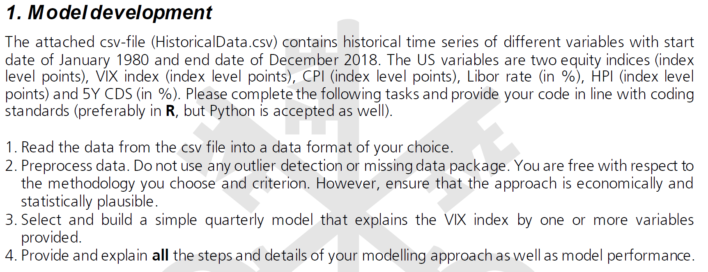
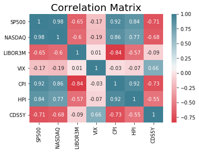
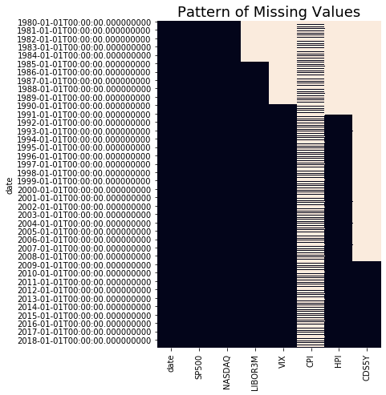
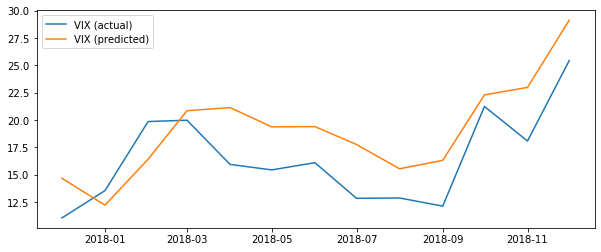

# VIX Modeling

## UBS - Quantitative Analyst - Assignment

The problem statement for the analysis below comes from **[UBS](https://de.wikipedia.org/wiki/UBS)** and is **part of an assignment for quantitative analysts**.

The **task** was as follows:


<br>

The **data** (HistoricalData.csv) can be found **[here](https://github.com/martschm/martschm.github.io/blob/master/ubs_quant_assignment/HistoricalData.csv)**.

## Required Packages/Libraries


```python
# data handling/wrangling
import datetime as dt
import numpy as np
import pandas as pd

# plotting
import matplotlib.pyplot as plt
%matplotlib inline
import seaborn as sns

# modeling and model evaluation
from sklearn.linear_model import LinearRegression
from sklearn import metrics
```

## Custom Functions

### Plotting


```python
def plot_missing_values_pattern(df):
    plt.figure(figsize=(5,7.5))
    sns.heatmap(df.isnull(), cbar=False)
    plt.title("Pattern of Missing Values", fontsize=18)
    plt.show()
```


```python
def plot_all_data_over_time(df):
    fig = plt.figure(figsize=(15,20))
    ax1 = fig.add_subplot(421)
    ax1.title.set_text("SP500")
    ax1.plot(df["SP500"].fillna(0))
    ax2 = fig.add_subplot(422)
    ax2.title.set_text("NASDAQ")
    ax2.plot(df["NASDAQ"].fillna(0))
    ax3 = fig.add_subplot(423)
    ax3.title.set_text("LIBOR3M")
    ax3.plot(df["LIBOR3M"].fillna(0))
    ax4 = fig.add_subplot(424)
    ax4.title.set_text("VIX")
    ax4.plot(df["VIX"].fillna(0))
    ax5 = fig.add_subplot(425)
    ax5.title.set_text("CPI")
    ax5.plot(df["CPI"].interpolate().bfill())
    ax6 = fig.add_subplot(426)
    ax6.title.set_text("CDS5Y")
    ax6.plot(df["CDS5Y"].fillna(0))
    ax7 = fig.add_subplot(427)
    ax7.title.set_text("HPI")
    ax7.plot(df["HPI"].fillna(0))
    plt.show()
```

### Modeling


```python
def split_train_test(df, test_size):
    df_split = np.split(df, [int((1-test_size)*len(df))])
    X_train = df_split[0].drop(columns="VIX")
    y_train = df_split[0]["VIX"]
    X_test = df_split[1].drop(columns="VIX")
    y_test = df_split[1]["VIX"]
    return X_train, y_train, X_test, y_test
```

Function below calculates and prints the following performance measures:

- **Mean Absolute Error**, calculated as $\frac{1}{n}\sum_{i=1}^n |y_i - \hat y_i|$

- **Mean Squared Error**, calculated as $\frac{1}{n}\sum_{i=1}^n (y_i - \hat y_i)^2$

- **Root Mean Squared Error**, calculated as $\sqrt{\frac{1}{n}\sum_{i=1}^n (y_i - \hat y_i)^2}$


```python
def print_other_model_stats(y_test, y_pred):
    print(f"Mean Absolute Error: {round(metrics.mean_absolute_error(y_test, y_pred),2)}")
    print(f"Mean Squared Error: {round(metrics.mean_squared_error(y_test, y_pred),2)}")
    print(f"Root Mean Squared Error: {round(np.sqrt(metrics.mean_squared_error(y_test, y_pred)),2)}")
```

## Read Data

The csv-file (HistoricalData.csv) contains historical time series of different variables with start
date of January 1980 and end date of December 2018. The US variables are two equity indices (index
level points), VIX index (index level points), CPI (index level points), Libor rate (in %), HPI (index level
points) and 5Y CDS (in %).


```python
df = pd.read_csv("../HistoricalData.csv")
```


```python
print(f"Dataframe has {df.shape[0]} rows and {df.shape[1]} columns.")
```

    Dataframe has 468 rows and 8 columns.
    


```python
print(df.head(5))
```

         date   SP500  NASDAQ  LIBOR3M  VIX        CPI  HPI  CDS5Y
    0  198001  114.16  161.75      NaN  NaN        NaN  NaN    NaN
    1  198002  113.66  158.03      NaN  NaN        NaN  NaN    NaN
    2  198003  102.09  131.00      NaN  NaN  79.033333  NaN    NaN
    3  198004  106.29  139.99      NaN  NaN        NaN  NaN    NaN
    4  198005  111.24  150.45      NaN  NaN        NaN  NaN    NaN
    

## Preprocessing

### General


```python
# convert date-column to actual dates
df["date"] = pd.to_datetime(df["date"], format="%Y%m")

# min/max month in df
print(f"Min date in df: {df.date.min()}\nMax date in df: {df.date.max()}\n")

# plausibility check
date_range_check = ((df.date.max().year-df.date.min().year+1)*12 == df.shape[0])
print(f"Every month occurs in the time series: {date_range_check}")
```

    Min date in df: 1980-01-01 00:00:00
    Max date in df: 2018-12-01 00:00:00
    
    Every month occurs in the time series: True
    


```python
# mask for quarter-end-data
mask_quarter = df["date"].apply(lambda x: x.month in [3,6,9,12])
```


```python
# set the date as index
df.index = df["date"]
```


```python
# plot all indices
plot_all_data_over_time(df)
```


```python
plt.title("Correlation Matrix", fontsize=20)
df_corr = round(df.corr(),2)
cols = df_corr.columns
sns.heatmap(df_corr, xticklabels=cols, yticklabels=cols, annot=True, cmap=sns.diverging_palette(10, 220, n=1000))
plt.show()
```





### Missing Data


```python
print("Share of missing vales (in %):\n")
print(round(df.isnull().sum()/df.shape[0]*100,2))
```

    Share of missing vales (in %):
    
    date        0.00
    SP500       0.00
    NASDAQ      0.00
    LIBOR3M    12.61
    VIX        25.64
    CPI        66.67
    HPI        28.63
    CDS5Y      73.72
    dtype: float64
    


```python
plot_missing_values_pattern(df)
```





```python
print("Months with missing data for CPI Index:")
print(list(df[df.CPI.isnull()].CPI.index.month.value_counts().sort_index().index))
```

    Months with missing data for CPI Index:
    [1, 2, 4, 5, 7, 8, 10, 11]
    


```python
# CPI:
# Only quarterly data are available for CPI. For this reason I have decided to use forward-fill.
# Alternatively, one could have interpolated linearly between the data points, but this did not have
# a significant impact on the performance of the model.

df["CPI"] = df["CPI"].ffill().bfill()
```

## Modeling

### Using the entire Time-Series 


```python
df_vers1 = df[df["VIX"].notnull()].drop(columns=["date","CDS5Y"]).copy()
df_vers1["HPI"] = df_vers1["HPI"].bfill() # let the HPI start at 100 using back-fill
```


```python
# perform a simple split into training and test data
X_train, y_train, X_test, y_test = split_train_test(df=df_vers1, test_size=0.1)
```


```python
# build a simple linear regression model
lm_vers1 = LinearRegression().fit(X_train, y_train)
```


```python
# predicted VIX
y_pred = pd.Series(lm_vers1.predict(X_test), index=y_test.index)
```


```python
# plot VIX vs. VIX (predicted)
plt.figure(figsize=(10,4))
plt.plot(y_test, label="VIX (actual)")
plt.plot(pd.Series(lm_vers1.predict(X_test), index=y_test.index), label="VIX (predicted)")
plt.legend()
plt.show()
```


Using $R^2$ (default scoring method for LinearRegression in sklearn) to evaluate model-performance:


```python
print(f"R2-value of model: {round(lm_vers1.score(X_test, y_test),2)}")
```

    R2-value of model: -0.58
    

Our $R^2$ is negative, indicating that the model we built **fits worse than a horizontal line**.


```python
print_other_model_stats(y_test, y_pred)
```

    Mean Absolute Error: 3.62
    Mean Squared Error: 20.88
    Root Mean Squared Error: 4.57
    

Let's try if we can boost our model by selecting a different time-window for training.

### Using index-values since 10/2008

I chose 10/2008 as start date, because from here on we have CDS5Y available and otherwise there are no more missing values in the data.


```python
df_vers2 = df[df["CDS5Y"].notnull()].drop(columns=["date"]).copy()
```


```python
# perform a simple split into training and test data
X_train, y_train, X_test, y_test = split_train_test(df=df_vers2, test_size=0.1)
```


```python
# build a simple linear regression model
lm_vers2 = LinearRegression(fit_intercept=False).fit(X_train, y_train)
```


```python
# predicted VIX
y_pred = pd.Series(lm_vers2.predict(X_test), index=y_test.index)
```


```python
# plot VIX vs. VIX (predicted)
plt.figure(figsize=(10,4))
plt.plot(y_test, label="VIX (actual)")
plt.plot(pd.Series(lm_vers2.predict(X_test), index=y_test.index), label="VIX (predicted)")
plt.legend()
plt.show()
```





```python
print(f"R2-value of model: {round(lm_vers2.score(X_test, y_test),2)}")
```

    R2-value of model: 0.21
    


```python
print_other_model_stats(y_test, y_pred)
```

    Mean Absolute Error: 3.32
    Mean Squared Error: 12.96
    Root Mean Squared Error: 3.6
    

Although still far from perfect - from the above performance measures it is obvious that model *lm_vers2* predicts VIX better than the model built using the whole time series.

The model coefficients are as follows:


```python
dict_coef = {}
for coef, feat in zip(lm_vers2.coef_, X_train.columns):
    dict_coef[feat] = coef
```


```python
df_model_coef_final = (
    pd.DataFrame(dict_coef, index=[0])
    .T
    .reset_index()
)
df_model_coef_final.columns = ["Variable", "Coefficient"]
```


```python
print(df_model_coef_final)
```

      Variable  Coefficient
    0    SP500    -0.016577
    1   NASDAQ    -0.001662
    2  LIBOR3M     7.989031
    3      CPI     0.092293
    4      HPI     0.134953
    5    CDS5Y     0.007458
    
